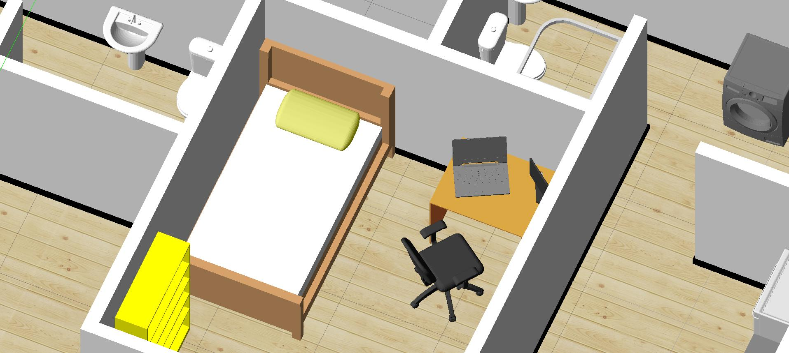
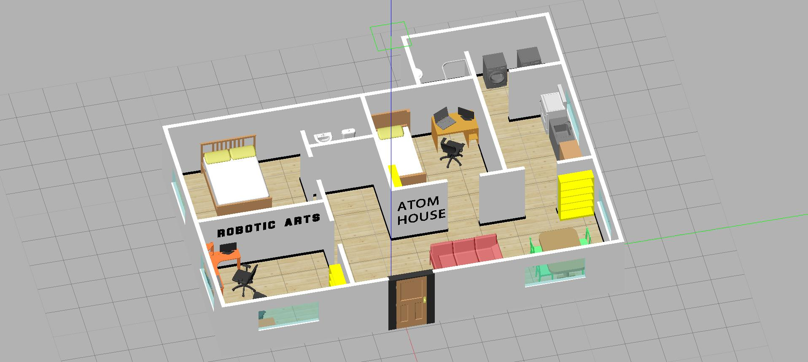

# roboticarts_gazebo_worlds

This repository contains a database of models and worlds for Gazebo created by Robert Vasquez Zavaleta.

The vast majority of CAD files have been obtained from https://grabcad.com . However all of them were modified with Solidworks to optimize them. Then textures, colors and collisions were added in Gazebo. Finally, the models were created.

Tested on Gazebo 7.0.0



### 1. Requisites

- Gazebo 7 or higher
- ROS Kinetic or higher

### 2.  Installation

Clone the database into your local machine, for example in your ROS workspace:

```
$ cd ~/catkin_ws/src
$ git clone https://github.com/RoboticArts/roboticarts_gazebo_worlds
```

Copy the models to the Gazebo model directory. By default it is a hidden folder in ```/home/username/.gazebo```

```
$ cd ~/catkin_ws/src/roboticarts_gazebo_worlds
$ sudo cp -a ./gazebo_models/. ~/.gazebo/models
```

Copy the worlds to the Gazebo worlds directory. By default it is found in ```/usr/share/gazebo-7/worlds```
You must replace ```gazebo-7``` with the version you use

```
$ cd ~/catkin_ws/src/roboticarts_gazebo_worlds
$ cp -a ./gazebo_worlds/. /usr/share/gazebo-7/worlds/
```

This step is optional. The ```utils``` folder contains the package ```rai_start_world```. Compile it to visualize the worlds in gazebo

```
$ cd ~/catkin_ws
$ source devel/setup.bash
$ catkin_make --only-pkg-with-deps rai_start_world
```


### 3. Launch the world!

If you installed start_world package, you can test the worlds. 

```
$ roslaunch rai_start_world world.launch world_name:=worlds/atom2_house.world
```




To select another world, use the ```world_name``` parameter. Remember to add the ```worlds/``` prefix. For example:
```
$ world_name:=worlds/empty_house.world
```

List of current available worlds:

```
- atom2_house
```

### 4. Some notes

No need to copy worlds to Gazebo worlds directory. You can choose another directory. Make sure that the ```world_name``` parameter gets the full path to where the world is located.


